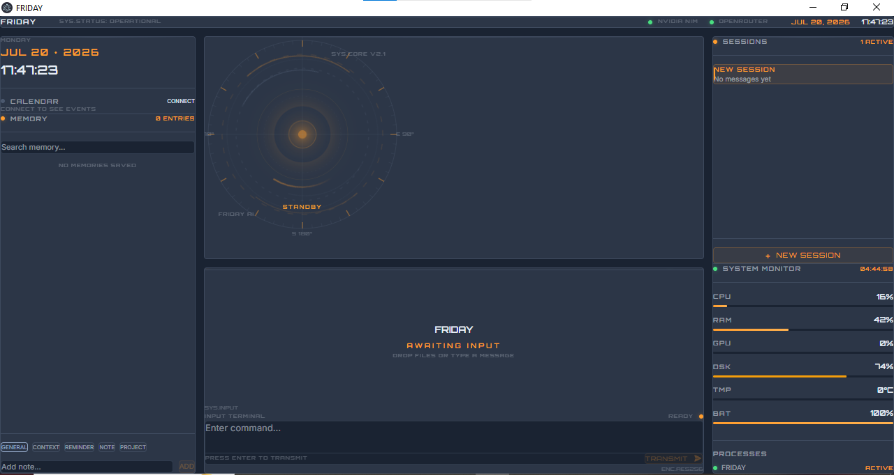

<div align="center">

# FRIDAY

### Your Personal AI Desktop Assistant


An AI-powered desktop assistant with a futuristic engineering blueprint UI, built for everyday tasks and system handling.

</div>

---

## About

**Project Friday** is a portable AI desktop assistant designed to be your personal Jarvis. It combines a sleek Iron Man HUD-inspired interface with real AI capabilities — analyze images, manage files, monitor your system, and chat with an AI that actually helps.

Built as a standalone `.exe` that runs on any Windows machine with zero setup. Drop a file, ask a question, or just let it monitor your system in the background.

---

## Features

### Core
- **AI Chat** — Multi-provider AI backend with automatic fallback (NVIDIA NIM → OpenRouter)
- **Vision Analysis** — Drop images for detailed AI-powered analysis of UIs, screenshots, code, documents
- **File Intelligence** — Drag & drop any file (text, code, images) for instant analysis
- **Markdown + Code Rendering** — Rich responses with syntax highlighting and copy-to-clipboard

### System
- **Real-time System Monitor** — Live CPU, RAM, disk usage, temperature, battery, network speed
- **Persistent Memory** — Save, search, pin, and organize notes across sessions
- **Session Management** — Multiple chat sessions with auto-titling

### Integrations
- **Google Calendar** — OAuth2 integration to view upcoming events
- **Command Palette** — Quick access to everything with `Ctrl+K`

### Design
- **Engineering Blueprint UI** — Dark HUD aesthetic inspired by Stark Industries
- **HUD Elements** — Rotating rings, energy core, crosshair, scan arcs
- **Orbitron Typography** — Futuristic font for status and HUD elements

---

## Screenshots

<div align="center">



*FRIDAY Desktop — Engineering Blueprint UI*

</div>

---

## Tech Stack

| Layer | Technology |
|---|---|
| **Frontend** | React 19, TypeScript 6, Tailwind CSS 4 |
| **Build** | Vite 8 |
| **Desktop** | Electron 43 (portable `.exe`) |
| **AI Providers** | NVIDIA NIM (`nemotron-super-49b`), OpenRouter |
| **Vision** | `nvidia/nemotron-nano-12b-v2-vl:free` via OpenRouter |
| **Calendar** | Google Calendar API (OAuth2) |
| **System** | Node.js `os`, PowerShell (Windows metrics) |

---

## Installation

### Prerequisites
- **Windows 10/11** (64-bit)
- **Node.js 18+** (only if building from source; not needed for the `.exe`)

---

### Option 1: Download the `.exe` (Recommended)

1. **Download** `FRIDAY.exe` from the [v1.0.0 release](https://github.com/londhepratik2008-maker/project-friday/releases/tag/v1.0.0)

2. **Create the config folder** — FRIDAY expects API keys at a specific path. Create this folder structure next to the exe:
   ```
   FRIDAY/
   ├── FRIDAY.exe
   └── resources/
       └── app/
           └── electron/
               └── data/
                   └── api-config.json
   ```

3. **Create `api-config.json`** with your API keys:
   ```json
   {
     "nvidia": {
       "key": "nvapi-YOUR_NVIDIA_KEY",
       "model": "nvidia/llama-3.3-nemotron-super-49b-v1"
     },
     "openrouter": {
       "key": "sk-or-v1-YOUR_OPENROUTER_KEY",
       "visionModel": "nvidia/nemotron-nano-12b-v2-vl:free",
       "textModel": "openrouter/free"
     }
   }
   ```

4. **Get API keys:**
   - **NVIDIA NIM** (free): https://build.nvidia.com — sign up, get a `nvapi-` key
   - **OpenRouter** (free tier): https://openrouter.ai — sign up, get a `sk-or-v1-` key

5. **Double-click `FRIDAY.exe`** — done

---

### Option 2: Build from Source

1. **Install Node.js** from https://nodejs.org (LTS version)

2. **Clone the repo:**
   ```bash
   git clone https://github.com/londhepratik2008-maker/project-friday.git
   cd project-friday/apps/desktop
   ```

3. **Install dependencies:**
   ```bash
   npm install
   ```

4. **Create the config file:**
   ```bash
   mkdir -p electron/data
   ```
   Then create `electron/data/api-config.json` with the JSON from Option 1 above.

5. **Run in dev mode:**
   ```bash
   npm run desktop
   ```

6. **Or build the exe:**
   ```bash
   npm run dist
   ```
   The exe will be in the `release/` folder.

---

### Troubleshooting

| Issue | Fix |
|---|---|
| "Cannot find module" error | Make sure `electron/data/api-config.json` exists |
| Chat returns error | Check your API keys are valid and not expired |
| Vision/image analysis fails | Make sure your OpenRouter key is active (free tier has limits) |
| Blank screen | Run `npm run dev` instead to see error messages |

> **Note:** API keys are loaded from a gitignored config file and never committed to the repository.

---

## Roadmap

### Phase 1 — Core Intelligence (Complete)
- [x] AI Chat with multi-provider fallback
- [x] Engineering blueprint / HUD UI
- [x] Markdown + code syntax highlighting
- [x] Copy, regenerate, stop generation
- [x] Real-time system monitoring
- [x] Persistent memory (JSON storage)
- [x] Command palette (`Ctrl+K`)

### Phase 2 — File Intelligence (Complete)
- [x] Drag & drop file support
- [x] Image analysis via vision models
- [x] Text/code file reading
- [x] Multimodal message format

### Phase 3 — Desktop Control (Planned)
- [ ] Launch & manage applications
- [ ] Volume/brightness control
- [ ] Screenshot capture & analysis
- [ ] Clipboard management

### Phase 4 — Project Workspace (Planned)
- [ ] Task management & milestones
- [ ] Per-project memory panels
- [ ] File organization suggestions
- [ ] Smart project summaries

### Phase 5 — AI Automation (Planned)
- [ ] Daily morning briefings
- [ ] Smart reminders & scheduling
- [ ] Email draft assistance
- [ ] Proactive system alerts

---

## Current Progress

| Feature | Status |
|---|---|
| AI Chat (NVIDIA + OpenRouter) | Working |
| Vision / Image Analysis | Working |
| File Drop & Analysis | Working |
| System Monitor | Working |
| Persistent Memory | Working |
| Session Management | Working |
| Google Calendar | Working |
| Command Palette | Working |
| Engineering Blueprint UI | Complete |
| Voice Assistant | In Progress |
| OS-level File Management | In Progress |
| Desktop Control | Planned |
| Project Workspace | Planned |

---

## Project Structure

```
project-friday/
├── README.md
├── apps/
│   └── desktop/                  # Main Electron + React app
│       ├── electron/
│       │   ├── main.cjs          # Electron main process + IPC
│       │   ├── preload.js        # Context bridge
│       │   ├── google-calendar.cjs
│       │   └── data/             # Runtime config & memory
│       ├── src/
│       │   ├── App.tsx           # Main application
│       │   ├── components/
│       │   │   ├── center/       # AICore visualization
│       │   │   ├── chat/         # Chat UI + file drop
│       │   │   ├── memory/       # Memory panel
│       │   │   ├── monitor/      # System monitor
│       │   │   ├── sessions/     # Session manager
│       │   │   └── layout/       # Sidebar
│       │   └── types/
│       └── package.json
```

---

## Contributing

Contributions are welcome! Here's how:

1. **Fork** the repository
2. **Create** a feature branch (`git checkout -b feature/amazing-feature`)
3. **Commit** your changes (`git commit -m 'Add amazing feature'`)
4. **Push** to the branch (`git push origin feature/amazing-feature`)
5. **Open** a Pull Request

### Development Setup

```bash
npm install
npm run desktop    # Starts Vite + Electron in dev mode
```

---

## License

This project is licensed under the MIT License — see the [LICENSE](LICENSE) file for details.

---

<div align="center">

Built with passion for AI-assisted productivity.

**FRIDAY** — *Just a regular AI, doing irregular things.*

</div>
